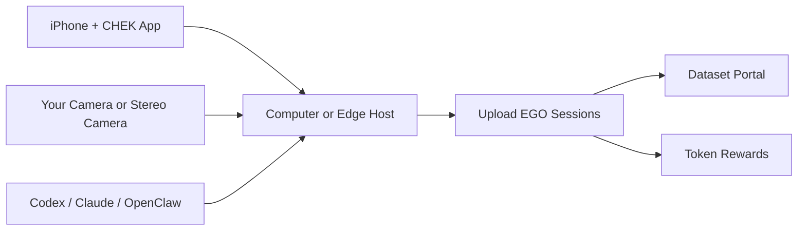

[English](./README.md) | [简体中文](./README.zh-CN.md)

# CHEK EGO Miner

Crowdsource robot data scarcity.

One phone plus one computer is enough to start the new era of EGO data mining:
capture first-person data, contribute it, and earn tokens.

## Start Here

- Download the iOS app: [TestFlight](https://testflight.apple.com/join/RrYdeDUv)
- Choose your hardware: [Hardware Guide](./docs/hardware.md)
- Let an agent guide you step by step:
  - [Codex Guide](./docs/agent-guides/codex.md)
  - [Claude Guide](./docs/agent-guides/claude.md)
  - [OpenClaw Guide](./docs/agent-guides/openclaw.md)
- Browse and download contributed datasets:
  - [EGO Dataset Portal](https://www-dev.chekkk.com/humanoid/ego-dataset)

## What This Project Is

CHEK EGO Miner is the public-facing repo for people who want to:

- capture EGO data with a phone and a computer
- scale up with a stereo camera or a dedicated edge machine
- use AI agents to guide installation and troubleshooting
- contribute data to the crowd dataset economy
- search and download useful contributed datasets

## System View



## Hardware Tiers

| Tier | Setup | Who it is for |
| --- | --- | --- |
| `Lite` | computer + your own camera | fastest way to start |
| `Stereo` | computer + stereo camera | better spatial quality |
| `Pro` | edge machine + stereo camera | dedicated capture and higher throughput |

You will also need a first-person phone mount. See [Hardware Guide](./docs/hardware.md)
for buying criteria, setup tradeoffs, search keywords, and direct purchase
examples including China marketplace links.

## Agent-Guided Setup

If you want step-by-step help instead of reading long docs, start with:

- [AGENTS.md](./AGENTS.md)
- one of the ready-to-use prompts:
  - [Lite Install Prompt](./prompts/install-lite.md)
  - [Stereo Install Prompt](./prompts/install-stereo.md)
  - [Pro Edge Install Prompt](./prompts/install-pro-edge.md)
  - [Camera Troubleshooting Prompt](./prompts/troubleshoot-camera.md)

The recommended workflow is:

1. Tell the agent which hardware tier you have.
2. Tell the agent your OS and what is already installed.
3. Ask the agent to guide you one step at a time.
4. Do not let the agent skip hardware checks, app install, or camera validation.

## First Local Check

Before a longer install session, run the lightweight host self-check:

```bash
python3 scripts/check_host_basics.py
```

For a publish-safety check inside this public repo:

```bash
./scripts/scan_public_safety.sh .
```

Or use the public CLI:

```bash
./cli/chek-ego-miner doctor
./cli/chek-ego-miner readiness --tier lite
```

If you want to reinstall a Linux or macOS basic host from the public repo and
run the verified `basic` lane, start here:

```bash
./cli/chek-ego-miner install \
  --profile basic \
  --apply \
  --system-install \
  --enable-services

python3 -m pip install --user --break-system-packages -r scripts/edge_phone_vision_requirements.txt
./cli/chek-ego-miner fetch-phone-vision-models --json
./scripts/start_edge_phone_vision_service.sh

./cli/chek-ego-miner basic-e2e \
  --edge-base-url http://127.0.0.1:8080 \
  --edge-token chek-ego-miner-local-token \
  --trip-id trip-public-basic-e2e \
  --session-id sess-public-basic-e2e \
  --output-dir ./artifacts/basic-e2e \
  --json
```

If Homebrew-managed macOS `python3` blocks `pip install --user`, install the
same requirements into a compatible interpreter such as `python3.10`; the
start script will auto-select it when available.

This exact lane has already been verified on:

- a dedicated `Linux x86_64` edge host:
  - public repo reinstall succeeded
  - `systemd-user` basic service started successfully
  - synthetic capture -> local download -> public download export succeeded
  - `public_download/demo_capture_bundle.json` validated with `score_percent = 100.0`
- a local `macOS arm64` developer machine:
  - `install --apply --system-install --enable-services` auto-staged the runtime to `~/.chek-edge/runtime/macos/basic`
  - `launchd` basic service started successfully from that staged runtime root
  - `./scripts/start_edge_phone_vision_service.sh` auto-selected a compatible local Python interpreter
  - `basic-e2e` validated `public_download/demo_capture_bundle.json` with `score_percent = 100.0`
- `time_sync_samples` remains an advisory on the single-phone basic lane

## Dataset Portal

You can currently search and download contributed data from:

- [https://www-dev.chekkk.com/humanoid/ego-dataset](https://www-dev.chekkk.com/humanoid/ego-dataset)

## Current Public Scope

This repo already supports reproducible public `basic` host lanes on dedicated
Linux and local macOS
and continues to act as the public-first home for:

- onboarding
- hardware selection
- agent guidance
- public install docs and prompts
- contribution flow
- dataset discovery entrypoints
- public `basic` synthetic capture -> download -> validation regression

## Project Principles

- crowdsource the robot-data bottleneck
- lower the barrier to EGO data capture
- make agent-assisted bring-up a first-class path
- turn capture sessions into reusable robot-data assets

## Docs

- [Hardware Guide](./docs/hardware.md)
- [Launch Announcement](./docs/launch-announcement.md)
- [Public Roadmap](./docs/roadmap.md)
- [v0.1.0 Release Notes](./docs/releases/v0.1.0.md)
- [Quickstart](./docs/quickstart.md)
- [Hardware/Profile Mapping](./docs/profile-mapping.md)
- [Diagnostics](./docs/diagnostics.md)
- [Token Rewards](./docs/token-rewards.md)
- [Privacy, Consent, and Data License](./docs/privacy-data-license.md)
- [FAQ](./docs/faq.md)
- [Open-Source Release Checklist](./docs/open-source-release-checklist.md)
- [Codex Guide](./docs/agent-guides/codex.md)
- [Claude Guide](./docs/agent-guides/claude.md)
- [OpenClaw Guide](./docs/agent-guides/openclaw.md)
- [TODO](./TODO.md)

## Contributing

See [CONTRIBUTING.md](./CONTRIBUTING.md).

## Security

See [SECURITY.md](./SECURITY.md).

## License

See [LICENSE](./LICENSE).
