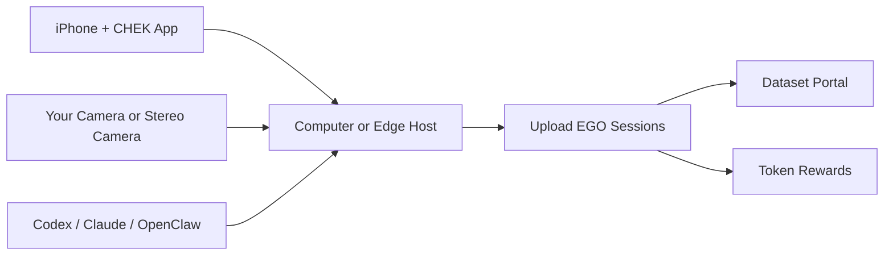

[English](./README.md) | [简体中文](./README.zh-CN.md)

# CHEK EGO Miner

Capture first-person EGO data with a phone and computer, contribute sessions,
and browse reusable datasets.

## Start Here

- Download the iOS app: [TestFlight](https://testflight.apple.com/join/RrYdeDUv)
- Choose your hardware: [Hardware Guide](./docs/hardware.md)
- Get step-by-step help:
  - [Codex Guide](./docs/agent-guides/codex.md)
  - [Claude Guide](./docs/agent-guides/claude.md)
  - [OpenClaw Guide](./docs/agent-guides/openclaw.md)
- Browse and download contributed datasets:
  - [EGO Dataset Portal](https://www-dev.chekkk.com/humanoid/ego-dataset)

## What You Can Do

- start with one phone and one computer
- add a stereo camera when you want better spatial cues
- move to a dedicated edge setup for higher-throughput capture
- use an AI assistant for guided install and troubleshooting
- contribute sessions and explore downloadable datasets

## Public-First Scope

This repository is the public-first entry point for contributors. It should
give people a clear install path, working operator surfaces, agent-guided
troubleshooting, and a usable frontend without forcing them to understand the
full internal runtime topology first.

As the project evolves, this repo should keep that public-first experience
while avoiding a second long-term copy of the same runtime or module source.
The goal is to deliver runnable frontend and installation assets in a
contributor-friendly way, without turning this repo into a duplicate
implementation tree.

## System View



## Choose a Setup

| Tier | Setup | Who it is for |
| --- | --- | --- |
| `Lite` | computer + your own camera | fastest way to start |
| `Stereo` | computer + stereo camera | better spatial quality |
| `Pro` | edge machine + stereo camera | dedicated capture and higher throughput |

You will also need a first-person phone mount. See [Hardware Guide](./docs/hardware.md)
for buying criteria, setup tradeoffs, search keywords, and direct purchase
examples including China marketplace links.

## Get Step-by-Step Help

If you want guided setup instead of reading long docs, start with:

- [AGENTS.md](./AGENTS.md)
- one of the ready-to-use prompts:
  - [Lite Install Prompt](./prompts/install-lite.md)
  - [Stereo Install Prompt](./prompts/install-stereo.md)
  - [Pro Edge Install Prompt](./prompts/install-pro-edge.md)
  - [Camera Troubleshooting Prompt](./prompts/troubleshoot-camera.md)

Recommended flow:

1. Tell the assistant which hardware tier you have.
2. Share your OS and what is already installed.
3. Ask for one step at a time.
4. Keep hardware checks, app install, and camera validation in the flow.

## Before You Install

Before a longer install session, run the lightweight host self-check:

```bash
python3 scripts/check_host_basics.py
```

If you plan to share your own fork or public changes, run:

```bash
./scripts/scan_public_safety.sh .
```

Or use the CLI:

```bash
./cli/chek-ego-miner doctor
./cli/chek-ego-miner readiness --tier lite
./cli/chek-ego-miner readiness --tier pro
```

## Lite Setup on Linux or macOS

If you want the quickest supported setup path, start here:

```bash
./cli/chek-ego-miner install \
  --profile basic \
  --apply \
  --system-install \
  --enable-services

python3 -m pip install --user --break-system-packages -r scripts/edge_phone_vision_requirements.txt
./cli/chek-ego-miner fetch-phone-vision-models --json
./scripts/start_edge_phone_vision_service.sh

./cli/chek-ego-miner basic-e2e \
  --edge-base-url http://127.0.0.1:8080 \
  --edge-token chek-ego-miner-local-token \
  --trip-id trip-public-basic-e2e \
  --session-id sess-public-basic-e2e \
  --output-dir ./artifacts/basic-e2e \
  --json
```

If Homebrew-managed macOS `python3` blocks `pip install --user`, install the
same requirements into a compatible interpreter such as `python3.10`; the
start script will auto-select it when available.

After the basic flow finishes, you should see:

- `ok: true`
- `validation.ok: true`
- `validation.score_percent: 100.0`
- `public_download/demo_capture_bundle.json` in your output directory

Notes:

- This path is intended for `Linux x86_64` and `macOS arm64` basic hosts.
- On macOS, `install --system-install --enable-services` stages the runtime
  under `~/.chek-edge/runtime/macos/basic`.
- `time_sync_samples` can stay empty on the single-phone basic path.

## Pro Setup on Jetson

If you want the full `Pro` runtime path on Jetson, bootstrap the machine first.
This brings in:

- stereo calibration
- the Wi-Fi sensing model and `sensing-server`
- `edge-orchestrator`, `ruview-leap-bridge`, and `ruview-unitree-bridge` binaries
- `RuView/ui-react/dist`
- an existing Jetson GPU VLM environment plus SmolVLM model cache

```bash
./cli/chek-ego-miner jetson-professional-bootstrap -- --force
./cli/chek-ego-miner install \
  --profile professional \
  --apply \
  --system-install \
  --runtime-edge-root "$PWD"
```

If you only want the Jetson VLM path, use the bundled sidecar and model fetch
flow:

```bash
./cli/chek-ego-miner install \
  --profile professional \
  --apply \
  --system-install \
  --enable-services

python3 -m pip install --user -r scripts/edge_vlm_requirements.txt
./cli/chek-ego-miner fetch-vlm-models --json
./cli/chek-ego-miner vlm-start
```

If the target Jetson already has a working GPU VLM environment and local model
cache, you can wire only those VLM assets and enable the sidecar through
`systemd-user`:

```bash
./cli/chek-ego-miner jetson-vlm-bootstrap -- --force
./cli/chek-ego-miner service-install \
  --profile professional \
  --service chek-edge-vlm-sidecar \
  --enable \
  --runtime-edge-root "$PWD"
```

Notes:

- `fetch-vlm-models` downloads the core Hugging Face files needed by
  `transformers`.
- Default model files are stored under `model-candidates/huggingface/`.
- A successful Jetson bring-up should look like:
  - `./cli/chek-ego-miner readiness --tier pro` reports the host is ready
  - required services reach `active`
  - `/health`, `/association/hint`, `/api/v1/stream/status`, and `/infer`
    return live responses on the host

## Dataset Portal

Search and download contributed data from:

- [https://www-dev.chekkk.com/humanoid/ego-dataset](https://www-dev.chekkk.com/humanoid/ego-dataset)

## What You Can Do Today

- onboard a new capture setup
- choose hardware and accessories
- use prompts for guided setup
- run the Lite/basic path on Linux or macOS
- bring up the Pro Jetson VLM and service path
- learn how contribution, rewards, and dataset discovery work

## Docs

- [Hardware Guide](./docs/hardware.md)
- [Quickstart](./docs/quickstart.md)
- [Hardware/Profile Mapping](./docs/profile-mapping.md)
- [Diagnostics](./docs/diagnostics.md)
- [Token Rewards](./docs/token-rewards.md)
- [Privacy, Consent, and Data License](./docs/privacy-data-license.md)
- [FAQ](./docs/faq.md)
- [Codex Guide](./docs/agent-guides/codex.md)
- [Claude Guide](./docs/agent-guides/claude.md)
- [OpenClaw Guide](./docs/agent-guides/openclaw.md)

## Contributing

See [CONTRIBUTING.md](./CONTRIBUTING.md).

## Security

See [SECURITY.md](./SECURITY.md).

## License

See [LICENSE](./LICENSE).
