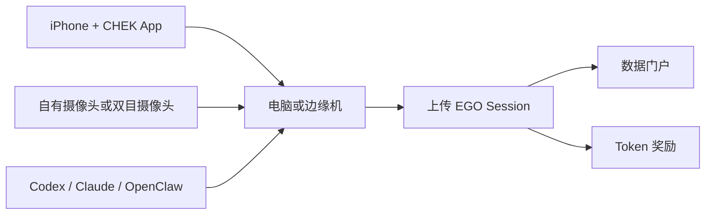

[English](./README.md) | [简体中文](./README.zh-CN.md)

# CHEK EGO Miner

用一台手机和一台电脑开始采集第一视角 EGO 数据，贡献 session，并检索可复用的数据集。

## 先看这里

- 下载 iOS 应用：[TestFlight](https://testflight.apple.com/join/RrYdeDUv)
- 选择你的硬件方案：[硬件指南](./docs/hardware.md)
- 获取一步一步的指导：
  - [Codex 指南](./docs/agent-guides/codex.md)
  - [Claude 指南](./docs/agent-guides/claude.md)
  - [OpenClaw 指南](./docs/agent-guides/openclaw.md)
- 检索和下载大家贡献的数据：
  - [EGO Dataset 数据门户](https://www.chekkk.com/humanoid/ego-dataset)

## 你可以用它做什么

- 用手机和电脑开始采集第一视角 EGO 数据
- 在需要更好空间信息时升级到双目摄像头
- 在需要更高吞吐时升级到专用边缘机
- 借助 Codex、Claude、OpenClaw 这类 agent 做安装与排障
- 贡献自己的 session，并检索别人贡献的数据

## 能力归边

从公开产品入口的角度看，`chek-ego-miner` 需要把 `SLAM`、`VLM`、`时间同步`
这三类能力都暴露成用户可安装、可启动、可诊断、可操作的入口，这样用户自己组装
边缘机或只用电脑安装时，才能真的把链路跑起来。

但这不等于这三类能力都应该在 `chek-ego-miner` 里各维护一套长期独立实现：

- `SLAM`
  - 目前仍然更强地耦合在内部整机工程线，尤其是 sensing bring-up、标定、
    replay、训练门槛和工程观测这几块
  - `chek-ego-miner` 应该提供 public 安装与操作入口，但不应该再分叉出第二套
    长期维护的核心 SLAM 栈
- `VLM`
  - 必须能直接通过 `chek-ego-miner` 被用户使用，包括模型下载、sidecar 启动、
    service 接线和 public 诊断链路
  - 但底层 runtime 语义仍应和内部整机工程线持续收敛，而不是演变成两套不同的
    VLM 实现
- `时间同步`
  - 本质上是两条产品线都会依赖的采集质量能力
  - `chek-ego-miner` 负责 public 安装、校验和用户可见反馈
  - 更深的整机标定、工程观测和工厂集成能力可以继续放在 `chek-edge-runtime`

后面的总规则很简单：如果两边表达的是同一个能力，在 `modules/`、`profiles/`、
`services/`、install backend 或共享 UI panel 里就不应该长期双写，而应该继续往
shared building block、模板或版本化资产去收口。

## 能力归边

从公开产品入口的角度看，`chek-ego-miner` 需要把 `SLAM`、`VLM`、`时间同步`
这三类能力都暴露成用户可安装、可启动、可诊断、可操作的入口，这样用户自己组装
边缘机或只用电脑安装时，才能真的把链路跑起来。

但这不等于这三类能力都应该在 `chek-ego-miner` 里各维护一套长期独立实现：

- `SLAM`
  - 目前仍然更强地耦合在内部整机工程线，尤其是 sensing bring-up、标定、
    replay、训练门槛和工程观测这几块
  - `chek-ego-miner` 应该提供 public 安装与操作入口，但不应该再分叉出第二套
    长期维护的核心 SLAM 栈
- `VLM`
  - 必须能直接通过 `chek-ego-miner` 被用户使用，包括模型下载、sidecar 启动、
    service 接线和 public 诊断链路
  - 但底层 runtime 语义仍应和内部整机工程线持续收敛，而不是演变成两套不同的
    VLM 实现
- `时间同步`
  - 本质上是两条产品线都会依赖的采集质量能力
  - `chek-ego-miner` 负责 public 安装、校验和用户可见反馈
  - 更深的整机标定、工程观测和工厂集成能力可以继续放在 `chek-edge-runtime`

后面的总规则很简单：如果两边表达的是同一个能力，在 `modules/`、`profiles/`、
`services/`、install backend 或共享 UI panel 里就不应该长期双写，而应该继续往
shared building block、模板或版本化资产去收口。

## 系统视图



## 选择你的方案

| 档位 | 方案 | 适合谁 |
| --- | --- | --- |
| `Lite` | 电脑 + 自己的摄像头 | 想最低门槛开跑的人 |
| `Stereo` | 电脑 + 外接双目摄像头 | 想要更好空间质量的人 |
| `Pro` | 边缘机 + 双目摄像头 | 想做专用采集与更高吞吐的人 |

此外还建议准备一个第一视角手机支架。购买思路、选型标准和搜索关键词见
[硬件指南](./docs/hardware.md)，其中也包含淘宝和抖音购买链接示例。

## 获取一步一步的指导

如果你不想自己啃长文档，可以直接从下面开始：

- [AGENTS.md](./AGENTS.md)
- 复制一个现成 prompt 给 agent：
  - [Lite 安装 Prompt](./prompts/install-lite.md)
  - [Stereo 安装 Prompt](./prompts/install-stereo.md)
  - [Pro 边缘机 Prompt](./prompts/install-pro-edge.md)
  - [摄像头排障 Prompt](./prompts/troubleshoot-camera.md)

推荐操作方式：

1. 先告诉 agent 你是 `Lite / Stereo / Pro` 哪一档。
2. 再告诉 agent 你的操作系统，以及你已经装好了什么。
3. 要求 agent 一次只给你一步，并等待你反馈结果。
4. 不要让 agent 跳过硬件检查、App 安装和相机验证。

## 安装前先做这些检查

在进入更长的安装流程前，可以先跑轻量自检：

```bash
python3 scripts/check_host_basics.py
```

如果你准备公开分享自己的 fork 或改动，可以跑：

```bash
./scripts/scan_public_safety.sh .
```

或者直接用 CLI：

```bash
./cli/chek-ego-miner doctor
./cli/chek-ego-miner readiness --tier lite
./cli/chek-ego-miner readiness --tier pro
```

## Linux 或 macOS 上的 Lite/basic 安装路径

如果你想先走最直接的受支持路径，可以从这里开始：

```bash
./cli/chek-ego-miner install \
  --profile basic \
  --apply \
  --system-install \
  --enable-services

python3 -m pip install --user --break-system-packages -r scripts/edge_phone_vision_requirements.txt
./cli/chek-ego-miner fetch-phone-vision-models --json
./scripts/start_edge_phone_vision_service.sh

./cli/chek-ego-miner basic-e2e \
  --edge-base-url http://127.0.0.1:8080 \
  --edge-token chek-ego-miner-local-token \
  --trip-id trip-public-basic-e2e \
  --session-id sess-public-basic-e2e \
  --output-dir ./artifacts/basic-e2e \
  --json
```

如果 macOS 上的 Homebrew `python3` 因 PEP 668 拒绝 `pip install --user`，
可以把同样的依赖装到兼容解释器里，例如 `python3.10`；启动脚本检测到后会自动切过去。

这条 basic 路径成功后，你应该看到：

- `ok: true`
- `validation.ok: true`
- `validation.score_percent: 100.0`
- 输出目录里生成 `public_download/demo_capture_bundle.json`

说明：

- 这条路径适合 `Linux x86_64` 和 `macOS arm64` 的 basic 宿主。
- 在 macOS 上，`install --system-install --enable-services` 会把 runtime
  staging 到 `~/.chek-edge/runtime/macos/basic`。
- 单手机 basic 路径里 `time_sync_samples` 可以为空。

## Jetson 上的 Pro 安装路径

如果你要走 Jetson 的完整 `Pro` 运行面，可以先执行 bootstrap。它会接入：

- stereo 标定文件
- Wi-Fi sensing 模型与 `sensing-server`
- `edge-orchestrator`、`ruview-leap-bridge`、`ruview-unitree-bridge` 二进制
- `RuView/ui-react/dist`
- 现成的 Jetson GPU VLM 环境和 SmolVLM 模型缓存

```bash
./cli/chek-ego-miner jetson-professional-bootstrap -- --force
./cli/chek-ego-miner install \
  --profile professional \
  --apply \
  --system-install \
  --runtime-edge-root "$PWD"
```

如果你只想走 Jetson 的 VLM 路径，也可以直接使用仓里自带的 VLM sidecar
和模型下载链：

```bash
./cli/chek-ego-miner install \
  --profile professional \
  --apply \
  --system-install \
  --enable-services

python3 -m pip install --user -r scripts/edge_vlm_requirements.txt
./cli/chek-ego-miner fetch-vlm-models --json
./cli/chek-ego-miner vlm-start
```

如果目标 Jetson 已经有现成的 GPU VLM 环境和本地模型目录，也可以只接入
VLM 资产，再由 `systemd-user` 启 sidecar：

```bash
./cli/chek-ego-miner jetson-vlm-bootstrap -- --force
./cli/chek-ego-miner service-install \
  --profile professional \
  --service chek-edge-vlm-sidecar \
  --enable \
  --runtime-edge-root "$PWD"
```

说明：

- `fetch-vlm-models` 会下载 `transformers` 运行所需的核心 Hugging Face 文件。
- 模型默认放在 `model-candidates/huggingface/` 下。
- Jetson 路径成功后，你应该看到：
  - `./cli/chek-ego-miner readiness --tier pro` 报告宿主可用
  - 所需服务进入 `active`
  - `/health`、`/association/hint`、`/api/v1/stream/status`、`/infer`
    在宿主上返回正常结果

## 数据门户

可以通过下面的入口检索和下载大家贡献的数据：

- [https://www.chekkk.com/humanoid/ego-dataset](https://www.chekkk.com/humanoid/ego-dataset)

## 现在可以做什么

- 完成新设备的上手
- 选择硬件与配件
- 用 prompts 获取一步一步的安装帮助
- 在 Linux 或 macOS 上完成 Lite/basic 路径
- 在 Jetson 上完成 Pro 的 VLM 与服务启动路径
- 了解数据贡献、奖励和数据检索入口

## 文档入口

- [硬件指南](./docs/hardware.md)
- [Quickstart](./docs/quickstart.md)
- [硬件与 profile 映射](./docs/profile-mapping.md)
- [诊断工具](./docs/diagnostics.md)
- [Token 奖励说明](./docs/token-rewards.md)
- [隐私、同意与数据许可](./docs/privacy-data-license.md)
- [常见问题](./docs/faq.md)
- [Codex 指南](./docs/agent-guides/codex.md)
- [Claude 指南](./docs/agent-guides/claude.md)
- [OpenClaw 指南](./docs/agent-guides/openclaw.md)

## 贡献方式

见 [CONTRIBUTING.md](./CONTRIBUTING.md)。

## 安全问题

见 [SECURITY.md](./SECURITY.md)。

## 许可证

见 [LICENSE](./LICENSE)。
