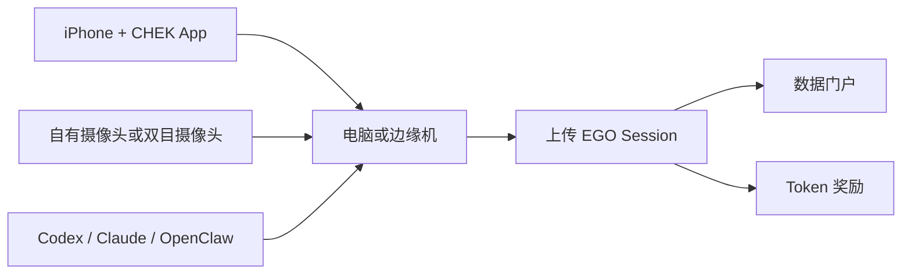

[English](./README.md) | [简体中文](./README.zh-CN.md)

# CHEK EGO Miner

众包解决机器人数据紧缺问题。

一台手机配一台电脑，就能开始新时代的数据“挖矿”：
采 EGO 数据，贡献数据，赚取 token。

## 先看这里

- 下载 iOS 应用：[TestFlight](https://testflight.apple.com/join/RrYdeDUv)
- 选择你的硬件方案：[硬件指南](./docs/hardware.md)
- 让 agent 一步一步带你做：
  - [Codex 指南](./docs/agent-guides/codex.md)
  - [Claude 指南](./docs/agent-guides/claude.md)
  - [OpenClaw 指南](./docs/agent-guides/openclaw.md)
- 检索和下载大家贡献的数据：
  - [EGO Dataset 数据门户](https://www-dev.chekkk.com/humanoid/ego-dataset)

## 这个项目是干什么的

`CHEK EGO Miner` 是一个面向公开用户的仓库，服务下面几类场景：

- 用手机和电脑开始采集第一视角 EGO 数据
- 升级到双目摄像头或边缘机，提升采集质量和吞吐
- 借助 Codex、Claude、OpenClaw 这类 agent 做安装与排障
- 把数据贡献到众包数据体系
- 检索和下载别人贡献的数据

## 系统视图



## 硬件三档

| 档位 | 方案 | 适合谁 |
| --- | --- | --- |
| `Lite` | 电脑 + 自己的摄像头 | 想最低门槛开跑的人 |
| `Stereo` | 电脑 + 外接双目摄像头 | 想要更好空间质量的人 |
| `Pro` | 边缘机 + 双目摄像头 | 想做专用采集与更高吞吐的人 |

此外还建议准备一个第一视角手机支架。购买思路、选型标准和搜索关键词见
[硬件指南](./docs/hardware.md)。

## Agent 手把手安装

如果你不想自己啃长文档，可以直接从下面开始：

- [AGENTS.md](./AGENTS.md)
- 复制一个现成 prompt 给 agent：
  - [Lite 安装 Prompt](./prompts/install-lite.md)
  - [Stereo 安装 Prompt](./prompts/install-stereo.md)
  - [Pro 边缘机 Prompt](./prompts/install-pro-edge.md)
  - [摄像头排障 Prompt](./prompts/troubleshoot-camera.md)

推荐操作方式：

1. 先告诉 agent 你是 `Lite / Stereo / Pro` 哪一档。
2. 再告诉 agent 你的操作系统，以及你已经装好了什么。
3. 要求 agent 一次只给你一步，并等待你反馈结果。
4. 不要让 agent 跳过硬件检查、App 安装和相机验证。

## 第一个本地检查

在进入更长的安装流程前，可以先跑轻量自检：

```bash
python3 scripts/check_host_basics.py
```

如果你要检查这个 public 仓里是否混进了 internal-only 信息，可以跑：

```bash
./scripts/scan_public_safety.sh .
```

或者直接用 public CLI：

```bash
./cli/chek-ego-miner doctor
./cli/chek-ego-miner readiness --tier lite
```

## 数据门户

当前可以通过下面的入口检索和下载大家贡献的数据：

- [https://www-dev.chekkk.com/humanoid/ego-dataset](https://www-dev.chekkk.com/humanoid/ego-dataset)

## 当前 public 范围

这个仓正在建设成一个 public-first 的入口，主要负责：

- onboarding
- 硬件盘点与购买建议
- agent 使用指南
- 对外安装文档与 prompts
- 数据贡献流程
- 数据检索入口

内部工程事实源仍然保留在 private repo。边界说明见
[Public / Private Split](./docs/public-private-split.md)。

## 仍在推进中的内容

- public 安装脚本还在迁移中
- 最终开源许可证还没定稿
- 隐私、贡献协议、奖励规则还需要 public 文案
- 不是所有宿主都已经形成“一条命令、完整验证”的安装体验

## 项目理念

- 众包解决机器人数据瓶颈
- 降低 EGO 数据采集门槛
- 把 agent 辅助安装当成第一公民
- public 文档只承诺真实验证过的能力

## 文档入口

- [硬件指南](./docs/hardware.md)
- [Quickstart](./docs/quickstart.md)
- [硬件与内部 profile 映射](./docs/profile-mapping.md)
- [诊断工具](./docs/diagnostics.md)
- [Token 奖励说明](./docs/token-rewards.md)
- [隐私、同意与数据许可](./docs/privacy-data-license.md)
- [常见问题](./docs/faq.md)
- [开源发布检查清单](./docs/open-source-release-checklist.md)
- [Public / Private Split](./docs/public-private-split.md)
- [Codex 指南](./docs/agent-guides/codex.md)
- [Claude 指南](./docs/agent-guides/claude.md)
- [OpenClaw 指南](./docs/agent-guides/openclaw.md)
- [TODO](./TODO.md)

## 贡献方式

见 [CONTRIBUTING.md](./CONTRIBUTING.md)。

## 安全问题

见 [SECURITY.md](./SECURITY.md)。

## 许可证

见 [LICENSE](./LICENSE)。
