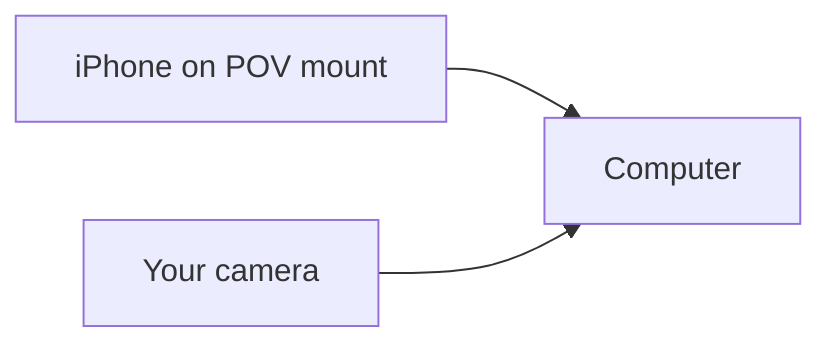
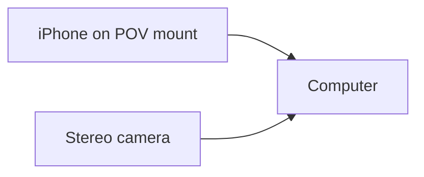
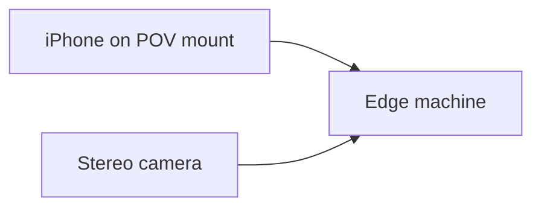

# Hardware Guide

## Goal

Pick the cheapest setup that still lets you start collecting useful EGO data.

## First-person phone mount

You need a stable first-person phone mount before anything else.

Recommended buying criteria:

- chest or shoulder mounting is preferred over handheld mounting
- the phone should be firmly locked, not just clipped loosely
- the mount should support walking, bending, and turning
- the phone camera should not be blocked by the bracket
- the setup should be comfortable for 10-30 minute sessions

Suggested search keywords:

- `first person phone mount`
- `chest phone mount for recording`
- `body worn smartphone holder`
- `POV phone mount`

Example products to anchor your search:

- Ulanzi magnetic chest mount harness:
  - <https://www.ulanzi.com/collections/ulanzi-for-gopro/products/chest-mount-harness-c021gbb1>
- PGYTECH CapLock magnetic smartphone neck mount:
  - <https://www.pgytechbag.com/product/pgytech-caplock-magnetic-smartphone-neck-mount-max/>
- Mainland China marketplace examples:
  - Taobao share link:
    - <https://e.tb.cn/h.iMtThciXXQuNjjk?tk=GrlR5fHlibQ>
  - Douyin product link:
    - <https://v.douyin.com/tnlIBM5XOWk/>

## Tier 1: Lite

### Setup

- one computer
- your own camera
- one iPhone with the CHEK app
- one first-person phone mount

### Best for

- first-time contributors
- trying the workflow with minimum budget
- indoor or desk-side experiments

### Buying advice

- any reasonably modern laptop or desktop is fine for the first pass
- start with the camera you already have before buying a new one
- if you want a compact desktop example, a current Mac mini is a reasonable anchor SKU:
  - <https://www.apple.com/mac-mini/>

### Visual guide

## Tier 2: Stereo

### Setup

- one computer
- one stereo camera
- one iPhone with the CHEK app
- one first-person phone mount

### Best for

- contributors who want better spatial cues
- users who want to move beyond the Lite lane

### Buying advice

- choose a stereo camera with stable desktop support on your OS
- prefer models with active user communities and simple USB setup
- verify cable length, power needs, and mounting options before buying

Suggested search keywords:

- `USB stereo camera`
- `depth stereo camera for linux`
- `stereo webcam sdk`

Example stereo camera SKUs:

- Stereolabs ZED Mini:
  - <https://www.stereolabs.com/store/products/zed-mini>
- Stereolabs ZED 2i:
  - <https://www.stereolabs.com/en-hk/store/products/zed-2i>

### Visual guide

## Tier 3: Pro

### Setup

- one dedicated edge machine
- one stereo camera
- one iPhone with the CHEK app
- one first-person phone mount

### Best for

- higher-throughput capture
- more stable dedicated setups
- users who plan to contribute repeatedly

### Buying advice

- buy this tier only after you understand the Lite or Stereo workflow
- treat the edge machine as a dedicated capture host
- verify power, cooling, mounting, and network access before purchase

Example edge + stereo anchor SKUs:

- NVIDIA Jetson Orin Nano Super Developer Kit:
  - <https://www.nvidia.com/en-us/autonomous-machines/embedded-systems/jetson-orin/nano-super-developer-kit/>
- NVIDIA Jetson AGX Orin family overview:
  - <https://www.nvidia.com/en-us/autonomous-machines/embedded-systems/jetson-orin/>
- Stereolabs ZED Box Mini:
  - <https://www.stereolabs.com/store/products/zed-box-mini>
- Stereolabs ZED 2i:
  - <https://www.stereolabs.com/en-hk/store/products/zed-2i>

### Visual guide

## Recommendation

If you are unsure, start with `Lite`.

If you already know you want spatial depth, choose `Stereo`.

If you plan to run a dedicated capture station, choose `Pro`.

## Notes

- These example SKUs are meant to anchor your search, not lock you into one vendor.
- Verify local availability, shipping, and operating-system compatibility before purchase.
- Some marketplace links may redirect to region-specific or app-specific detail pages.
- The example product links in this document were link-checked on 2026-04-11.
